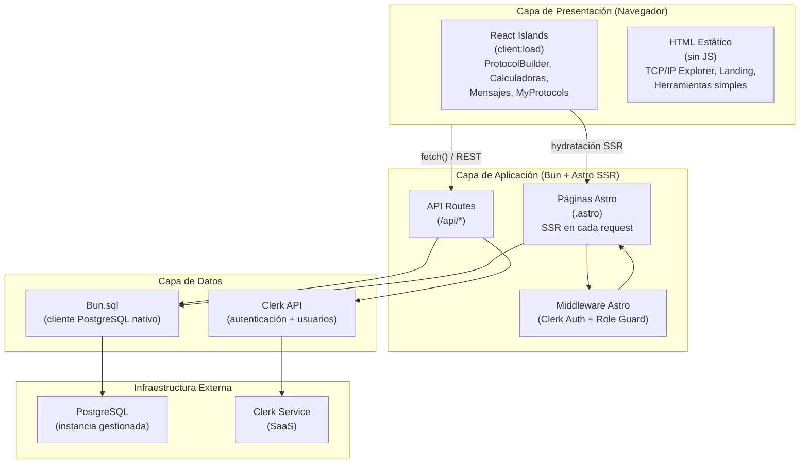
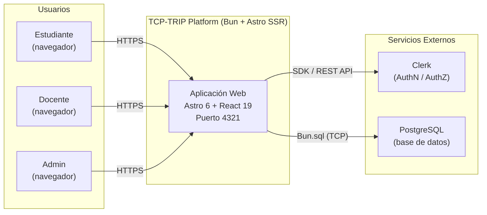
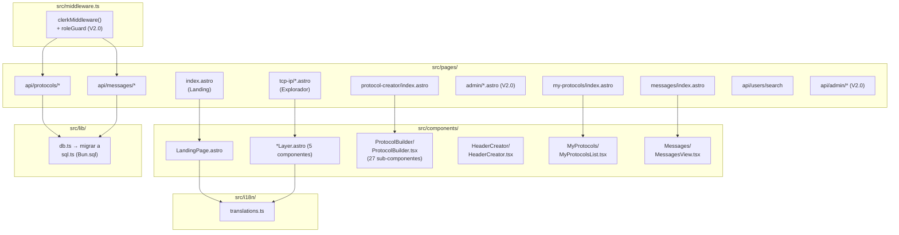

# Visión Arquitectónica General — TCP-TRIP

**Versión:** 1.1  
**Fecha:** 2026-04-14  
**Estado:** Aceptado  
**Deciders:** Equipo TCP-TRIP

---

## 1. Estilo Arquitectónico

### Decisión: Monolito Modular con Islands Architecture

TCP-TRIP es un **monolito modular SSR** implementado en Astro 6, con componentes interactivos aislados mediante el patrón **Islands Architecture** propio de Astro.

**Por qué no microservicios:** El equipo tiene 1-2 personas, el dominio es único (plataforma educativa de protocolos), el volumen de usuarios es bajo (< 100 simultáneos en contexto académico) y el tiempo de entrega es acotado por el calendario universitario. Microservicios agregarían sobrecarga operativa sin beneficio proporcional (ver ADR-001).

**Por qué Islands Architecture y no SPA pura:** La mayor parte del contenido de TCP-TRIP es informativo y estático (explorador TCP/IP, herramientas pedagógicas básicas). Solo los componentes que requieren interactividad real (ProtocolBuilder, calculadoras, mensajes) necesitan hidratación en el cliente. Este modelo reduce el JavaScript enviado al navegador y mejora los tiempos de carga iniciales.

**Por qué no hexagonal completa:** La arquitectura hexagonal es valiosa cuando existe alta variabilidad de adaptadores (múltiples bases de datos, múltiples canales de entrada/salida). Para este proyecto existe una sola BD (PostgreSQL) y un solo canal (HTTP). Aplicar hexagonal completa añadiría indirección sin beneficio real. En cambio, se aplica **separación de capas simplificada** dentro del monolito.

---

## 2. Diagrama de Capas del Sistema



---

## 3. Diagrama C4 — Nivel 2: Contenedores



---

## 4. Estrategia de Rendering por Tipo de Página

| Tipo de Página | Estrategia | Directiva Astro | Razón |
|---|---|---|---|
| Landing Page (`/`) | SSR con HTML estático | Sin directiva (servidor puro) | Contenido invariante; no requiere estado de cliente. |
| Explorador TCP/IP (`/tcp-ip/*`) | SSR con HTML estático | Sin directiva (servidor puro) | Contenido pedagógico fijo; no requiere interactividad. |
| Calculadoras simples (conversor de bases, ASCII) | SSR + componente Astro puro | Sin directiva | Las calculadoras están implementadas como componentes Astro con lógica en `<script>` tag vanilla. |
| Calculadora IPv4 (`/calculators/Ipv4Calculator`) | SSR + React Island | `client:load` | Requiere estado reactivo para recalcular en tiempo real al cambiar inputs. |
| Constructor de Protocolos (`/protocol-creator`) | SSR + React Island | `client:load` | Editor complejo con estado compartido entre 27+ sub-componentes. El editor no puede hidratarse de forma perezosa. |
| Mis Protocolos (`/my-protocols`) | SSR + React Island | `client:load` | Lista con acciones CRUD que dependen de la identidad del usuario. |
| Mensajes (`/messages`) | SSR + React Island | `client:load` | Vista de bandeja con datos dinámicos per-user. |
| Panel Admin (`/admin/*`) | SSR puro en Astro | Sin directiva o `client:idle` | Formularios simples de aprobación/rechazo; no requiere reactividad compleja. |
| Páginas de error (403, 404) | SSR puro | Sin directiva | Páginas simples sin interactividad. |

**Regla general de islands:** usar `client:load` solo cuando la interactividad es necesaria desde la carga inicial de la página. Preferir `client:idle` para componentes no críticos que pueden hidratarse tras la carga. No usar `client:only` salvo que el componente acceda exclusivamente a APIs del navegador y no tenga sentido en el servidor.

---

## 5. Principios Arquitectónicos

### P-001: Simplicidad deliberada (YAGNI + KISS)
Dado que el equipo tiene 1-2 personas y un plazo académico fijo, se elige siempre la solución más simple que cumpla el requisito. No se introduce abstracción sin un caso de uso concreto presente.

### P-002: Colocation de responsabilidades por dominio
El código se organiza por dominio (`ProtocolBuilder/`, `Messages/`, `MyProtocols/`) y no por tipo técnico (`components/`, `hooks/`, `utils/`). Esto reduce el salto entre archivos al trabajar en una funcionalidad.

### P-003: Sin estado compartido global salvo nanostores explícitas
El estado de la aplicación vive en el componente más cercano que lo necesita. El estado global (e.g., idioma activo, modo clase futuro) se gestiona exclusivamente mediante `nanostores`. Se evita Context de React para estado que cruce boundaries de islands.

### P-004: API Routes son la frontera de la aplicación
Toda escritura o lectura de datos pasa por las API Routes de Astro. Los componentes React nunca importan directamente `Bun.sql` ni `src/lib/db.ts`. La capa de datos es exclusiva del servidor.

### P-005: Autenticación siempre en el servidor primero
La verificación de autenticación y rol ocurre en el middleware de Astro antes de que cualquier handler de ruta se ejecute. Las validaciones del cliente son complementarias (UX), nunca la fuente de verdad de seguridad.

### P-006: Bilingüismo con español como idioma canónico
Toda nueva ruta, componente con texto visible, y clave de traducción se crea en español e inglés simultáneamente. No existe un "añadir i18n después". **El español es el idioma por defecto del sitio** (D-01, ADR-005): las rutas bajo la raíz `/` sirven contenido en español; las rutas bajo `/en/` sirven el equivalente en inglés. Esta decisión responde al contexto universitario colombiano del producto (UX-001).

### P-007: Trazabilidad de requisitos
Cada decisión arquitectónica significativa tiene su ADR. Cada ADR referencia el requisito funcional (`US-XXX`) o no funcional (`TC-XXX`, `UX-XXX`) que lo motiva.

---

## 6. Relaciones entre Componentes Principales



---

## 7. Estructura de Directorios

### 7.1 Estado actual (código base heredado)

```
src/
├── components/                  # Mezclado: componentes de dominio y UI genérica
│   ├── ProtocolBuilder/         # Editor de protocolos (27 sub-componentes React)
│   ├── HeaderCreator/           # Editor de valores de cabecera
│   ├── Messages/                # Vista de mensajes
│   ├── MyProtocols/             # Lista de protocolos del usuario
│   ├── icons/                   # Iconos SVG como componentes React
│   ├── *Layer.astro             # Capas TCP/IP sin carpeta propia (problema)
│   ├── LandingPage.astro        # Página de inicio
│   └── ...
├── i18n/
│   └── translations.ts          # Cadenas ES/EN
├── layouts/
│   ├── Layout.astro             # Layout base para rutas raíz (actualmente EN, debe ser ES)
│   └── es/Layout.astro          # Layout base ES (ubicación inconsistente)
├── lib/
│   ├── db.ts                    # DEPRECAR: SQLite/better-sqlite3
│   └── links/navLinks.ts
├── middleware.ts
├── pages/
│   ├── index.astro              # Landing (actualmente EN, debe ser ES — ver D-01)
│   ├── tcp-ip/, converters/, calculators/
│   ├── protocol-creator/, my-protocols/, messages/
│   ├── protocols/[shareCode]
│   ├── api/
│   └── es/                      # Espejo EN español (actualmente: rutas ES, debe ser /en/)
├── styles/global.css
└── types/ProtocolBuilder.ts
```

### 7.2 Estructura objetivo (P-001 — ver `docs/architecture/directory-structure.md`)

La estructura objetivo organiza el código **por dominio** en lugar de por tipo técnico. La migración completa, la tabla de archivos a mover y las convenciones están documentadas en `docs/architecture/directory-structure.md`.

```
src/
├── domains/
│   ├── protocols/               # Todo lo relativo al constructor y gestión de protocolos
│   ├── messages/                # Vista de mensajes y handlers de API
│   ├── tools/                   # Conversores y calculadoras
│   ├── tcpip/                   # Componentes de capas del modelo TCP/IP
│   └── admin/                   # Panel de administración y gestión de roles (V2.0)
├── shared/
│   ├── ui/                      # Componentes genéricos de UI (Navbar, Footer, etc.)
│   ├── icons/                   # Iconos SVG
│   ├── layouts/                 # Layouts base por idioma
│   ├── i18n/                    # translations.ts
│   ├── lib/                     # sql.ts (Bun.sql), navLinks.ts
│   └── stores/                  # nanostores de UI global
├── pages/                       # Solo orchestration — páginas Astro delgadas
│   ├── index.astro              # Landing ES (canónica — D-01)
│   ├── [secciones]/             # Rutas ES (canónicas)
│   ├── en/                      # Rutas EN (alternativas — D-01)
│   │   └── [secciones]/
│   └── api/                     # API Routes (servidor)
├── middleware.ts
└── types/                       # Tipos de dominio compartidos
```

---

## 8. Decisiones Arquitectónicas Resueltas

| ID | Decisión | ADR | Fecha |
|----|----------|-----|-------|
| D-01 | Español como idioma canónico. Rutas raíz en ES, `/en/` para inglés. | ADR-005 | 2026-04-14 |
| D-02 | Reconciliación automática Clerk ↔ BD mediante retry con backoff exponencial. | ADR-007 | 2026-04-14 |
| D-03 | Reestructuración de directorios por dominio (P-001). | `directory-structure.md` | 2026-04-14 |
| D-04 | Despliegue: Cloudflare (opción preferida) o Docker Compose en servidor universidad (alternativa). | ADR-006 | 2026-04-14 |
| D-05 | Email de notificación de rol via API de Clerk. | `roles-and-permissions.md` | 2026-04-14 |
| D-06 | Sin migración de datos desde SQLite. El schema de PostgreSQL se crea desde cero. | `database-schema.md` | 2026-04-14 |

## 9. Preguntas Abiertas con Impacto Arquitectónico

| ID | Pregunta | Impacto |
|----|----------|---------|
| Q-003 | ¿El Modo Clase (V2.0) necesita funcionar offline? | Si sí, requiere Service Worker y estrategia de caché de assets; cambia la arquitectura de deployment. |

---

## Changelog

| Versión | Fecha | Cambio |
|---------|-------|--------|
| 1.0 | 2026-04-14 | Versión inicial |
| 1.1 | 2026-04-14 | D-01: español como idioma por defecto. D-03: estructura de directorios por dominio. Resolución de Q-006 (ADR-006) y Q-007 (D-05). |
