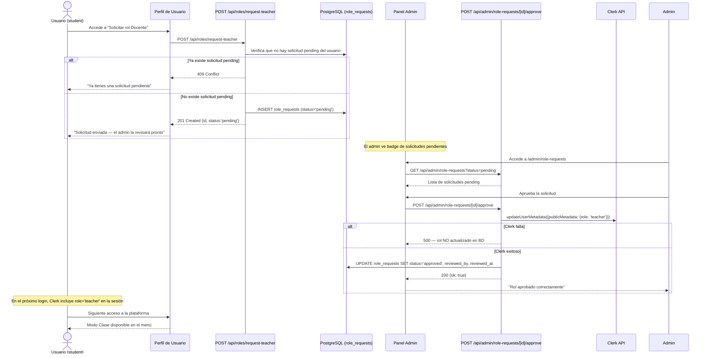

# Roles y Permisos — TCP-TRIP

**Versión:** 1.1  
**Fecha:** 2026-04-14  
**Estado:** Aceptado  
**Motiva:** TC-008 a TC-013, E-007, E-009, ADR-004, ADR-007

---

## 1. Los Tres Roles

| Rol | Cómo se obtiene | Quién lo asigna |
|-----|-----------------|-----------------|
| `student` | Por defecto al registrarse | Automático (Clerk) |
| `teacher` | Solicitud aprobada por admin | Administrador manualmente |
| `admin` | Configuración directa en `privateMetadata` de Clerk o variable de entorno `ADMIN_USER_ID` | El equipo de desarrollo (AS-005) |

**No existe self-service para `teacher` ni `admin`.** La elevación de privilegios siempre pasa por una acción humana explícita (TC-012).

---

## 2. Matriz de Permisos por Feature

| Feature | No autenticado | student | teacher | admin |
|---------|----------------|---------|---------|-------|
| Ver landing page | SI | SI | SI | SI |
| Ver explorador TCP/IP | SI | SI | SI | SI |
| Usar herramientas (bases, ASCII, IPv4) | SI | SI | SI | SI |
| Ver protocolo compartido (por share_code) | SI | SI | SI | SI |
| Registro e inicio de sesión | SI | N/A | N/A | N/A |
| Crear protocolo | NO | SI | SI | SI |
| Editar/eliminar protocolo propio | NO | SI | SI | SI |
| Compartir protocolo | NO | SI | SI | SI |
| Ver mis protocolos | NO | SI | SI | SI |
| Enviar mensajes | NO | SI | SI | SI |
| Recibir y leer mensajes | NO | SI | SI | SI |
| Solicitar rol docente | NO | SI | NO* | NO* |
| Activar Modo Clase | NO | NO | SI | SI |
| Generar ejercicios (V2.0) | NO | NO | SI | NO |
| Ver panel de administración | NO | NO | NO | SI |
| Listar todos los usuarios | NO | NO | NO | SI |
| Banear/desbanear usuarios | NO | NO | NO | SI |
| Aprobar/rechazar solicitudes de docente | NO | NO | NO | SI |
| Ver estadísticas de la plataforma | NO | NO | NO | SI |

`*` Un usuario con rol `teacher` o `admin` ya tiene un rol superior; no necesita solicitar.

---

## 3. Almacenamiento de Roles

**Decisión:** Los roles se almacenan en `publicMetadata` de Clerk, no en una tabla propia de PostgreSQL.

**Justificación completa:** Ver ADR-004.

**Estructura de `publicMetadata` en Clerk:**

```json
{
  "role": "student"
}
```

Los valores posibles son: `"student"`, `"teacher"`, `"admin"`.

**Cómo se lee el rol en el servidor:**

```typescript
// En el frontmatter de una página Astro o en una API Route
const auth = Astro.locals.auth();
const role = (auth.sessionClaims?.metadata as any)?.role ?? 'student';
```

**Por qué `publicMetadata` y no `privateMetadata` para el rol de docente:**

`publicMetadata` es accesible desde el cliente vía Clerk's JavaScript SDK, lo que permite que los componentes React puedan condicionar su UI según el rol sin una llamada adicional al servidor. `privateMetadata` es solo servidor; usarla para roles requeriría un endpoint adicional para exponer el rol al cliente.

**Excepción — admin:** La identificación del admin puede hacerse también via `ADMIN_USER_ID` como variable de entorno (alternativa más simple para un superadmin único). Ver sección 7.

---

## 4. Flujo Completo de Solicitud de Rol Docente



**Puntos críticos del flujo:**

1. **Atomicidad y resiliencia (D-02 — ADR-007):** La actualización de Clerk y la actualización de `role_requests` son dos operaciones independientes. Si Clerk falla, no se toca la BD. Si la BD falla tras actualizar Clerk (el caso más crítico), el handler reintenta la escritura en BD con **backoff exponencial** (hasta 3 intentos: 100ms → 200ms → 400ms). Si todos los reintentos fallan, el servidor registra el evento en el log y el mecanismo de **reconciliación al arranque** resuelve la inconsistencia en el próximo reinicio. Ver sección 4.1 para el detalle del mecanismo de reconciliación.

2. **Propagación del rol:** El nuevo rol `teacher` en `publicMetadata` de Clerk no se refleja en sesiones existentes del usuario. El usuario debe cerrar sesión y volver a iniciarla para que Clerk emita un nuevo token con el rol actualizado. Esto es un comportamiento esperado de JWT/sesiones. Se debe informar al usuario en la UI.

3. **Notificación al usuario por email (D-05):** Al aprobar o rechazar una solicitud, el sistema envía un email al usuario via la API de Clerk (`clerkClient.emails.createEmail()`). El email se envía después de la actualización exitosa en BD. El fallo del envío de email no revierte la aprobación; se registra como `warn` en el log del servidor. Ver sección 4.2 para el detalle del flujo de notificación.

---

### 4.1 Mecanismo de Reconciliación Clerk ↔ Base de Datos (D-02 — ADR-007)

**Problema:** Si el handler de aprobación actualiza el rol en Clerk exitosamente pero la escritura en BD falla (incluso tras los reintentos con backoff), `role_requests` queda en estado `pending` mientras Clerk ya tiene `role = 'teacher'`. La BD y Clerk están desincronizados.

**Solución elegida: Reconciliación al arranque del servidor.**

Al iniciar la aplicación (o al reiniciarse tras un fallo), el servidor ejecuta una función de reconciliación que detecta y corrige estas inconsistencias automáticamente:

```typescript
// src/shared/lib/reconcile.ts
// Llamar una vez al arrancar: await reconcileRoleRequests()

export async function reconcileRoleRequests(): Promise<void> {
  // 1. Obtener todas las solicitudes que siguen en 'pending' en la BD
  const pendingRequests = await sql`
    SELECT id, user_id FROM role_requests
    WHERE status = 'pending'
  `;

  for (const request of pendingRequests) {
    // 2. Consultar el rol actual del usuario en Clerk
    const user = await clerkClient.users.getUser(request.user_id);
    const currentRole = (user.publicMetadata as any)?.role;

    // 3. Si Clerk ya tiene role = 'teacher', la BD quedó desincronizada
    if (currentRole === 'teacher') {
      await sql`
        UPDATE role_requests
        SET status = 'approved',
            reviewed_at = NOW(),
            comment = 'Auto-reconciliado al arranque — rol ya asignado en Clerk'
        WHERE id = ${request.id}
      `;
      console.info(`[reconcile] Solicitud ${request.id} marcada como aprobada (usuario ${request.user_id} ya era teacher en Clerk)`);
    }
  }
}
```

**Cuándo se llama:** En el entry point de la aplicación o en un hook `onRequest` del middleware que corre una única vez al iniciar el proceso (usando una variable de módulo como flag).

**Por qué esta opción (Opción A) y no las alternativas:**
- **Opción B (job de fondo periódico):** Más compleja de implementar con Bun (requiere un worker o un cron interno). Para un contexto donde los reinicios son infrecuentes y la desincronización es rara, la reconciliación al arranque es suficiente.
- **Opción C (retry solo en el endpoint):** Ya se implementa como primera línea de defensa. La reconciliación al arranque es el mecanismo de recuperación para los casos en que los reintentos fallen.

La combinación **Opción C (retry en el endpoint) + Opción A (reconciliación al arranque)** es la solución adoptada.

### 4.2 Notificación por Email al Aprobar o Rechazar Solicitud (D-05)

**Servicio usado:** API de emails de Clerk (`clerkClient.emails.createEmail()`).

**Restricción crítica:** Solo se pueden enviar emails a usuarios registrados en Clerk para esta instancia. No es posible enviar a direcciones arbitrarias.

**Flujo de notificación:**

```
Aprobación exitosa en BD
        ↓
Obtener emailAddressId del usuario: clerkClient.users.getUser(userId)
        ↓
clerkClient.emails.createEmail({
  fromEmailName: "tcp-trip",
  subject: "Tu solicitud de rol Docente ha sido aprobada",
  body: "...",
  emailAddressId: user.emailAddresses[0].id
})
        ↓
¿Fallo del email?
├── Sí → console.warn (NO revertir la aprobación)
└── No → OK
```

**Contenido sugerido de los emails:**

| Evento | Asunto | Cuerpo mínimo |
|--------|--------|---------------|
| Aprobación | "Tu solicitud de rol Docente ha sido aprobada — TCP-TRIP" | Confirmación + instrucción de cerrar sesión y volver a iniciar para que el rol sea efectivo |
| Rechazo | "Actualización sobre tu solicitud de rol Docente — TCP-TRIP" | Notificación del rechazo + comentario del admin si se proporcionó |

**Nota para el desarrollador:** El texto de los emails debe estar en español (idioma canónico — D-01). Si se requiere soporte bilingüe en los emails, el idioma del usuario puede obtenerse desde su perfil en Clerk o asumirse español por defecto.

---

## 5. Protección de Rutas en el Middleware de Astro

### 5.1 Estado actual del middleware

```typescript
// src/middleware.ts (estado actual — V1.0)
import { clerkMiddleware } from "@clerk/astro/server";
export const onRequest = clerkMiddleware();
```

El middleware actual solo verifica que la sesión de Clerk es válida. No verifica roles.

### 5.2 Middleware extendido (V2.0)

```typescript
// src/middleware.ts (objetivo V2.0)
import { clerkMiddleware, createRouteMatcher } from "@clerk/astro/server";
import type { MiddlewareHandler } from "astro";

// Rutas que requieren autenticación mínima
const isAuthRequired = createRouteMatcher([
  '/my-protocols(.*)',
  '/messages(.*)',
  '/protocol-creator(.*)',
  '/es/my-protocols(.*)',
  '/es/messages(.*)',
  '/es/protocol-creator(.*)',
  '/api/protocols(.*)',
  '/api/messages(.*)',
  '/api/users(.*)',
  '/api/roles(.*)',
]);

// Rutas que requieren rol teacher
const isTeacherRequired = createRouteMatcher([
  '/class-mode(.*)',
  '/es/class-mode(.*)',
]);

// Rutas que requieren rol admin
const isAdminRequired = createRouteMatcher([
  '/admin(.*)',
  '/es/admin(.*)',
  '/api/admin(.*)',
]);

export const onRequest: MiddlewareHandler = clerkMiddleware(async (auth, context) => {
  const { userId, sessionClaims, redirectToSignIn } = auth();
  const role = (sessionClaims?.metadata as any)?.role ?? 'student';
  const url = new URL(context.request.url);

  // 1. Rutas que requieren autenticación
  if (isAuthRequired(context.request) && !userId) {
    return redirectToSignIn();
  }

  // 2. Verificar baneo del usuario (solo si está autenticado)
  if (userId) {
    const { sql } = await import('./lib/sql');
    const rows = await sql`
      SELECT is_banned FROM users
      WHERE clerk_user_id = ${userId}
      LIMIT 1
    `;
    if (rows[0]?.is_banned === true) {
      return new Response('Tu cuenta ha sido suspendida.', { status: 403 });
    }
  }

  // 3. Rutas que requieren rol teacher
  if (isTeacherRequired(context.request)) {
    if (!userId || !['teacher', 'admin'].includes(role)) {
      return new Response(null, { status: 403, headers: { location: '/' } });
    }
  }

  // 4. Rutas que requieren rol admin
  if (isAdminRequired(context.request)) {
    if (!userId || role !== 'admin') {
      return new Response(null, { status: 403, headers: { location: '/' } });
    }
  }
});
```

**Advertencia de rendimiento (TC-013):** La verificación de baneo hace una consulta SQL en cada request autenticado. Con el volumen esperado (< 100 usuarios simultáneos, AS-007) y el índice parcial `WHERE is_banned = TRUE`, el costo es negligible. Si el proyecto escala, considerar cachear el estado de baneo en la sesión de Clerk (`privateMetadata.isBanned`) para evitar la consulta SQL.

### 5.3 Tabla de rutas y niveles de protección

| Ruta (inglés + español) | Nivel de protección |
|-------------------------|---------------------|
| `/`, `/es/` | public |
| `/tcp-ip/*`, `/es/tcp-ip/*` | public |
| `/converters/*`, `/es/converters/*` | public |
| `/calculators/*`, `/es/calculators/*` | public |
| `/protocols/[shareCode]`, `/es/protocols/[shareCode]` | public |
| `/protocol-creator/*`, `/es/protocol-creator/*` | authenticated |
| `/my-protocols`, `/es/my-protocols` | authenticated |
| `/messages`, `/es/messages` | authenticated |
| `/class-mode/*`, `/es/class-mode/*` | teacher |
| `/admin/*`, `/es/admin/*` | admin |
| `/api/protocols/*` | authenticated |
| `/api/messages/*` | authenticated |
| `/api/users/search` | authenticated |
| `/api/roles/request-teacher` | authenticated |
| `/api/admin/*` | admin |

---

## 6. Protección en el Cliente (condicionales de UI)

La protección de rutas en el middleware es la fuente de verdad de seguridad. Las validaciones en el cliente son complementarias y sirven para mejorar la UX (no mostrar elementos que el usuario no puede usar).

```tsx
// Ejemplo en un componente React
import { useUser } from '@clerk/astro/react';

function Navbar({ lang }: { lang: string }) {
  const { user } = useUser();
  const role = (user?.publicMetadata as any)?.role ?? 'student';

  return (
    <nav>
      {/* Visible para todos */}
      <NavLink href="/tcp-ip">TCP/IP</NavLink>

      {/* Solo usuarios autenticados */}
      {user && <NavLink href="/my-protocols">Mis Protocolos</NavLink>}

      {/* Solo teachers y admins */}
      {['teacher', 'admin'].includes(role) && (
        <NavLink href="/class-mode">Modo Clase</NavLink>
      )}

      {/* Solo admin */}
      {role === 'admin' && (
        <NavLink href="/admin">Administración</NavLink>
      )}
    </nav>
  );
}
```

---

## 7. Identificación del Administrador

**Estrategia elegida:** Rol `admin` en `publicMetadata` de Clerk + variable de entorno `ADMIN_USER_ID` como fallback.

**Por qué no solo variable de entorno:** Si el proyecto crece post-grado y hay más de un mantenedor, hardcodear un único userId en el env var es un cuello de botella. El rol en `publicMetadata` es más extensible.

**Por qué no tabla de admins en BD:** Para un superadmin único (restricción explícita hasta V3.0), una tabla añade complejidad sin beneficio. El rol en Clerk es suficiente.

**Procedimiento para configurar el admin (AS-005):**

```bash
# Opción A: Vía API de Clerk (recomendada)
# Ejecutar una sola vez al provisionar la instancia

curl -X PATCH https://api.clerk.com/v1/users/{USER_ID} \
  -H "Authorization: Bearer $CLERK_SECRET_KEY" \
  -H "Content-Type: application/json" \
  -d '{"public_metadata": {"role": "admin"}}'

# Opción B: Vía variable de entorno (alternativa simple)
# En .env:
ADMIN_USER_ID=user_2xxxxxxxxxxxxxxxx
```

Si se usa la variable de entorno, el middleware la verifica como condición adicional:

```typescript
const isAdmin = role === 'admin' || userId === process.env.ADMIN_USER_ID;
```

---

## 8. Decisiones Resueltas

| ID | Pregunta | Resolución | Fecha |
|----|----------|-----------|-------|
| Q-007 | ¿Se notifica al usuario por email al aprobar/rechazar solicitud de rol? | Sí. Via `clerkClient.emails.createEmail()`. Solo usuarios registrados en Clerk. Ver sección 4.2. | 2026-04-14 |
| D-02 | ¿Qué pasa si la BD falla tras actualizar Clerk? | Retry con backoff exponencial (3 intentos) + reconciliación al arranque del servidor. Ver sección 4.1 y ADR-007. | 2026-04-14 |
| TC-conflicto-defaultLocale | ¿El rol `student` es explícito o implícito? | El rol `student` se asume cuando `publicMetadata.role` está ausente o es `undefined`. La lógica `role ?? 'student'` en el middleware es la convención definitiva. No se escribe `student` explícitamente al registrar un usuario. | 2026-04-14 |

---

## Changelog

| Versión | Fecha | Cambio |
|---------|-------|--------|
| 1.0 | 2026-04-14 | Versión inicial |
| 1.1 | 2026-04-14 | D-02: mecanismo de reconciliación Clerk ↔ BD (sección 4.1). D-05: flujo de notificación por email via Clerk (sección 4.2). Resolución de Q-007 y TC-conflicto-defaultLocale. |
